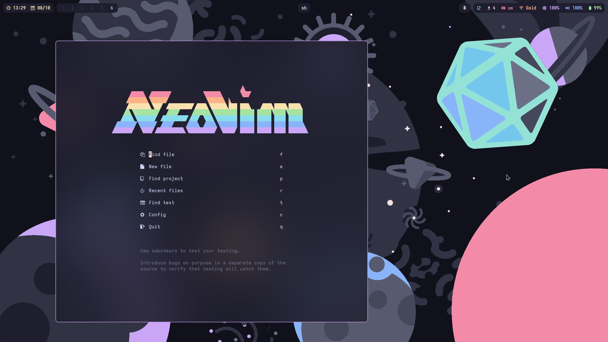

<h1 align="center">AmitGold's dotfiles</h1>


## Starring!

-   **Catppuccin Mocha**
-   **Hyprland**
-   **Papirus Icons**
-   **Waybar**
-   **Firefox**
-   **Kitty**
-   **Neovim**
-   **Wofi**

## Installation

### Desktop

```
paru -S hyprland-bin waybar-hyprland-git sddm sddm-sugar-candy-git wlogout wofi dunst papirus-icon-theme catppuccin-gtk-theme-mocha polkit-gnome wlsunset swayidle udev-block-notify blueman-applet brightnessctl swaylock-effects wofi-emoji wofi-calc wofi-wifi-menu-git playerctl grim slurp pipewire wireplumber xdg-desktop-portal-wlr wl-copy networkmanager
```

### Applications

```
paru -S thunar firefox deluge-gtk kitty wdisplays discord discocss spotify spicetify timeshift eog pavucontrol celluloid file-roller
```

### Terminal

```
paru -S zsh zsh-theme-powerlevel10k zoxide nvim zsh-autosuggestions fzf lf trash-cli exa ripgrep btop zsh-autopair-git zsh-vi-mode fzf-tab-git zsh-syntax-highlighting lazygit bat lesspipe fd
```
